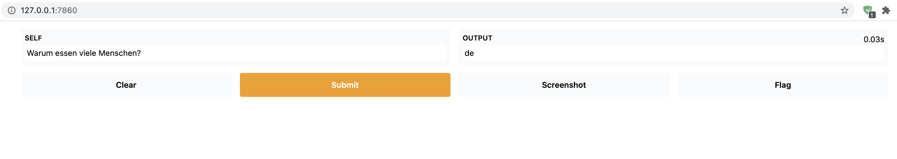

# NLPlayStore
Install, use and uninstall Machine Learning models, functions and more.

# Installation
`pip install git+https://github.com/flexudy/NLPlayStore.git`

# Usage

```python
from store.service_management import ServiceManager

input_text = "Hello, this is NLPlay. Your favorite store on Github."

service_manager = ServiceManager()

# Get a list of all services available
services_available = service_manager.get_service_names()

language_detector = service_manager.get_service("Flexudy-Fasttext-Language-Detector")

# Feel free to read the description
service_description = language_detector.get_description()

language_detector.install()

language_detector = language_detector.launch()

print(language_detector.play(input_text))
>>> "en"

# Now you can directly test services on your web interface thanks to Gradio (gradio.app).
language_detector.play_on_screen()

# Destroy services you don't need
language_detector.uninstall()
```

## Cheapity

```python
from store.service_management import ServiceManager

input_text = "Artificial Thermo-Machine Learning is the study of"

service_manager = ServiceManager()

service = service_manager.get_service("cheapity3")

service.install()

service = service.launch()

service.play_on_screen()

service.uninstall()
```
[](Gradio-NLPlay)
